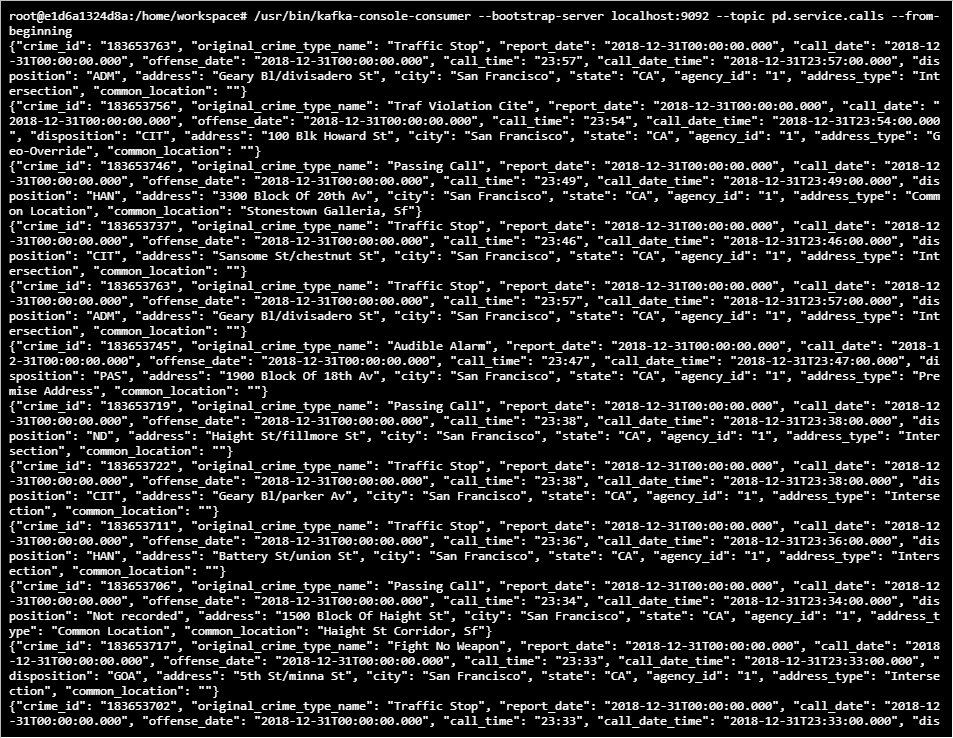
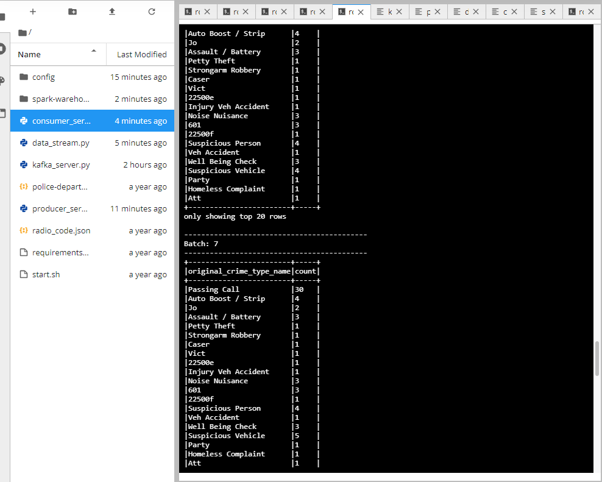
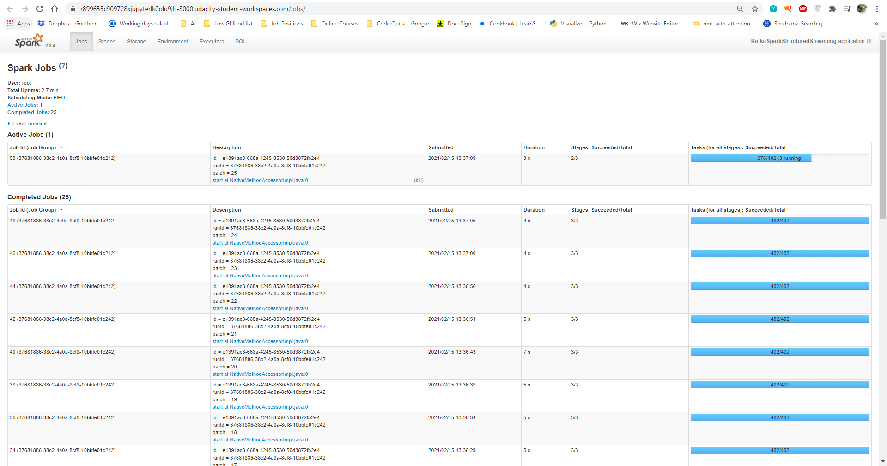

# SF Crime Statistics With Spark Streaming
Project for Udacity Nanodegree program compledted by Hema Sadhasivan

[](https://img.shields.io/badge/project-passed-success.svg)

## Introduction
In this project, a real-world dataset has been provided, on San Francisco crime incidents, and statistical analyses of the data using Apache Spark Structured Streaming need to be provided. A Kafka server will be generated to produce data and ingest it through Spark Structured Streaming.

## Project
The files in the following structure have been included in the Project Workspace, which contains three Python files (.py) that are the starter code, the project dataset (two json files of which one of them is a compressed zip file), and some other necessary resources.

### Project structure
```
.
├── config
│   ├── server.properties
│   └── zookeeper.properties
├── consumer_server.py
├── data_stream.py
├── kafka_server.py
├── producer_server.py
├── README.md
└── screenshots
    ├── Progress-reporter-after-executing-Spark-job.PNG
    ├── Spark-UI.PNG
    └── kafka-consumer-console-output.PNG
```

The following file should be created separately to check if the `kafka_server.py` is working properly:
`consumer_server.py`

### Environment

* Spark 2.3.4
* Kafka 0.10
* Python 3.7
   
## Project Steps 
- Come up with a Kafka topic name (my topic name is "pd.service.calls") and choose a port number (my choice: 9092)
- Completed the "TO-DO" parts in `producer_server.py`, `data_stream.py`, and `kafka_server.py` files
- Created consumer_server.py to check if my `kafka_server.py` is working as expected.
- Modified the zookeeper.properties and server.properties appropriately
- Verified the working of the project using several terminals as follow:
    - Terminal 1: To run `./start.sh`
    - Terminal 2: To run `/usr/bin/zookeeper-server-start config/zookeeper.properties`
    - Terminal 3: To run `/usr/bin/kafka-server-start config/server.properties`
    - Terminal 4: To run `python kafka_server.py`
    - Terminal 5: To run `/usr/bin/kafka-console-consumer --bootstrap-server localhost:9092 --topic pd.service.calls --from-beginning`
    - Terminal 6: To run `spark-submit --packages org.apache.spark:spark-sql-kafka-0-10_2.11:2.3.4 --master local[*] data_stream.py`

## Results
The project was successfully implemented with no errors.

After running the codes from terminal 1 to 5, I was able to get the Kafka Consumer Console working. Screen capture is shown below.

##### Kafka_Consumer_Console



Additionally, after running the code in terminal 6 I was able to execute the Spark jobs and retrieve the Progress Reporter and Spark UI screens capture shown below.

##### Spark_Job_Progress_Reporter



##### Spark_Streaming_UI


    

## Project Questions

##### 1. How did changing values on the SparkSession property parameters affect the throughput and latency of the data?
I compared several values of maxOffsetPerTrigger and maxRatePerPartition. It looks like the impact on throughput and on the latency of data is not much but one reason could be it is because of the size of the datasete. However, based on the literature, very large flush intervals may lead to latency spikes. When the flush actually takes place, usually a lot of data needs to be flushed. Moreover, it is an expensive operation, and a small flush interval may lead to excessive seeks. So, I conclude by saying that there is not constant optimum flush value. It has to be tested for different values for each dataset to determine optimum value.
    
##### 2. What were the 2-3 most efficient SparkSession property key/value pairs? Through testing multiple variations on values, how can you tell these were the most optimal?
A little bit of tuning is necessary to obtain the best performance out of a Spark Streaming application. In genereal, we need to consider the below options:

1. Firstly, an appropriate batch size needs to be set so that the batches of data can be processed as fast as they are received (i.e., data processing rate should keep up with the data ingestion rate).

2. Secondly, reducing the processing time of each batch of data by efficiently utilizing the cluster resources.

Also, I did modify the configuration values for MaxRatePerPartition and MaxOffsetPertrigger and set it to 100 which seems to work well. Initially, I did set these values to 200 and the data at the console consumer was not consumed as fast as it was at 100. This is my obsservation.

As per the literature in the course, achieving Parallelism can improve the performance. It is important to carefully choose the configuration parameter values rather than accepting the default values. It can be more like a trial and error method depending on various factors like dataset size, data processing speed, data ingestion rate, available resources and the like.
    
## Tips
A couple issues were encountered while working on the project. With the help of the posts from the others in Knowledge center, I managed to resolve the issues. Below are the link those: 
1. Unable to see data on Spark UI https://knowledge.udacity.com/questions/187420
2. Config files not working as expected https://knowledge.udacity.com/questions/80037

I would recommend everyone to look into the peer chat room or Knowledge Centre if you are stuck anywhere. Mentor help is also very useful and the mentors are really fast.
